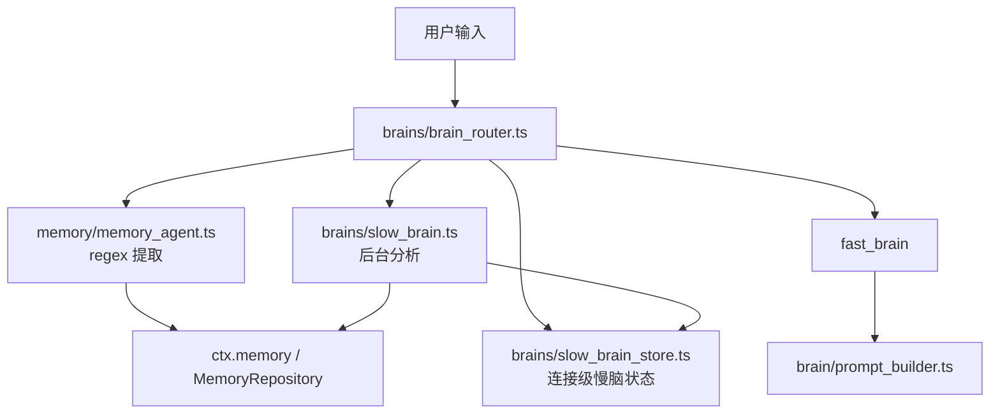
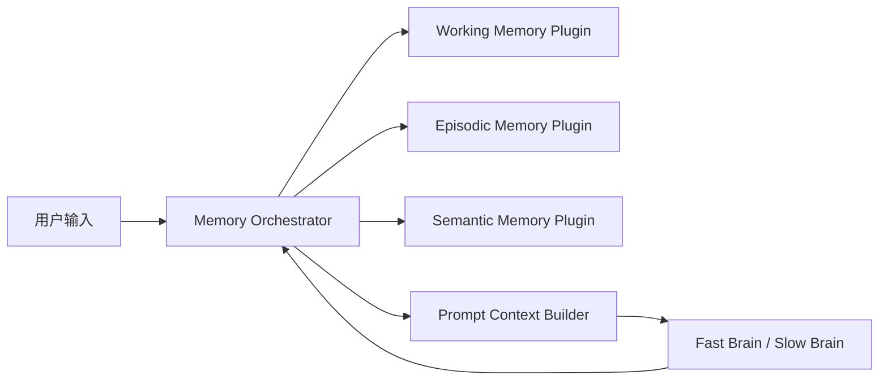

# Rem AI — Memory System

## 1. 文档目标

这份文档用于整理 Rem 当前的记忆系统实现，并定义后续演进方向。

目标有三件事：

1. 说明当前代码里“记忆”到底分布在哪些模块。
2. 明确当前实现为什么还不足以支撑强陪伴感和持久记忆。
3. 给出一个尽量贴合现有仓库、可渐进落地的记忆系统升级方案。

这不是一份“推倒重写”文档。它默认当前项目仍以“先保住可运行、可验证、可回退”为前提。

## 2. 设计目标

从产品角度，Rem 的记忆系统需要同时服务两类体验：

1. 陪伴感
   - Rem 要记得你是谁。
   - Rem 要记得你最近在经历什么。
   - Rem 要记得你们关系发展到了哪一步。
2. 工程可迭代性
   - 记忆层要可替换、可扩展，而不是散落在主对话流程里。
   - 新增一种记忆类型时，不应该重写整条 pipeline。

对应到架构上，记忆系统要回答四个问题：

1. 记什么
2. 什么时候写入
3. 什么时候召回
4. 召回后的内容如何进入 prompt

## 3. 当前实现总览

当前项目已经有“记忆系统的雏形”，但它还是由多个分散模块拼起来的，而不是一个统一编排层。



当前涉及记忆的核心模块如下：

### 3.1 会话上下文

文件：
- [brains/rem_session_context.ts](/Users/rare/Desktop/rem-ai/brains/rem_session_context.ts)

作用：
- 保存单条 WebSocket 连接上的状态。
- 当前包含：
  - `emotion`
  - `slowBrain`
  - `memory`
  - `history`

关键特点：
- `history` 是会话级短历史。
- `slowBrain` 是连接级状态对象。
- `memory` 是当前会话使用的 `MemoryRepository`。

### 3.2 轻量记忆提取

文件：
- [memory/memory_agent.ts](/Users/rare/Desktop/rem-ai/memory/memory_agent.ts)

作用：
- 从用户输入里用正则提取结构化事实。
- 当前主要提取：
  - 名字
  - 城市
  - 年龄
  - 工作
  - 喜好 / 不喜好
  - 宠物
  - 学校 / 专业

特点：
- 写入方式轻、成本低。
- 适合第一层 profile memory 抽取。
- 当前 retrieval 只是 `getAll()`，还不是“按语义/相关性检索”。

### 3.3 慢脑状态

文件：
- [brains/slow_brain_store.ts](/Users/rare/Desktop/rem-ai/brains/slow_brain_store.ts)
- [brains/slow_brain.ts](/Users/rare/Desktop/rem-ai/brains/slow_brain.ts)

作用：
- 保存陪伴体验最关键的一批状态：
  - `userProfile`
  - `relationship`
  - `topicHistory`
  - `moodTrajectory`
  - `conversationSummary`
  - `proactiveTopics`

当前这套状态很像“关系记忆 + 中期上下文”，但它仍然是连接级的，而不是稳定的用户级状态。

### 3.4 Prompt 注入

文件：
- [brain/prompt_builder.ts](/Users/rare/Desktop/rem-ai/brain/prompt_builder.ts)

作用：
- 把当前可用记忆写进 system prompt。

当前注入内容主要有两类：

1. `priorityContext`
   - 主要来自 `SlowBrainStore.synthesizeContext()`
2. `memory`
   - 主要来自 `MemoryRepository.getAll()` 的结果

问题在于：
- `priorityContext` 很有产品价值，但没有持久化。
- `memory` 是扁平列表，不是分层、按相关性召回的记忆上下文。

### 3.5 存储层

文件：
- [memory/memory_repository.ts](/Users/rare/Desktop/rem-ai/memory/memory_repository.ts)
- [storage/repositories/memory_repository.ts](/Users/rare/Desktop/rem-ai/storage/repositories/memory_repository.ts)
- [storage/schema.sql](/Users/rare/Desktop/rem-ai/storage/schema.sql)

作用：
- 提供内存版和数据库版的记忆存储。
- PG 层已经具备：
  - `importance`
  - `embedding`
  - `findSimilarMemories()`

这说明底层已经预留了语义召回能力，但当前主流程并没有真正使用它。

## 4. 当前读写链路

### 4.1 用户发来一条消息时

当前大致流程如下：

1. `brain_router.ts` 收到用户输入。
2. 调用 `extractMemory(userMessage, ctx.memory)`。
3. 调用 `retrieveMemory(ctx.memory)`，当前本质上是 `getAll()`。
4. 读取 `ctx.slowBrain.synthesizeContext()`。
5. 将 memory + slow brain context 一起送入 prompt。
6. fast brain 生成回复。
7. 回复结束后，再异步触发 `runSlowBrain()`。

### 4.2 slow brain 后台分析时

`runSlowBrain()` 当前会做三类事：

1. 本地规则分析
   - 话题
   - 情绪倾向
2. 可选的 LLM 结构化分析
   - 用户事实
   - 兴趣
   - personality note
   - 情绪底色
   - 对话摘要
   - 主动话题
   - relationship signal
3. 更新 `SlowBrainStore`
   - 以及一部分 memory repo

### 4.3 当前链路的本质

当前实现实际上已经有三种不同性质的数据在并行存在：

1. `history`
   - 最近几轮对话历史
2. `SlowBrainStore`
   - 关系状态、近期主题、情绪轨迹、摘要
3. `MemoryRepository`
   - 用户事实类长期记忆

问题不是“完全没有记忆系统”，而是这三层还没有被清晰建模成一个统一体系。

## 5. 当前实现的主要问题

### 5.1 关系记忆仍是连接级，不是用户级

`SlowBrainStore` 文件顶部已经明确写了“每条 WebSocket 连接独立一份”。

这会直接影响：
- familiarity
- emotionalBond
- preferredTopics
- moodTrajectory
- conversationSummary
- proactiveTopics

产品后果是：
- 刷新页面后，Rem 可能又像重新认识用户。
- 最像“陪伴关系”的那部分状态，稳定性反而最低。

### 5.2 当前长期记忆更像用户资料卡，不像共同经历

`memory_agent.ts` 当前擅长提取的是：
- 你叫什么
- 你住哪
- 你做什么工作
- 你喜欢什么

这些都重要，但它们更像 profile memory。

而真正能带来陪伴感的很多记忆其实是：
- 你最近为什么焦虑
- 你上次提到的面试后来怎么样了
- 你和朋友的矛盾有没有缓和
- 你不喜欢被直接说教

这些现在还没有被建模成一等公民。

### 5.3 retrieval 仍然是全量拿取，而不是按相关性召回

当前 `retrieveMemory()` 走的是 `repo.getAll()`。

问题在于：
- 记忆少时还能工作。
- 记忆一多，prompt 注入就会开始失真。
- 与当前输入最相关的记忆不一定会被优先使用。

虽然 PG 层已有 `findSimilarMemories()`，但它还没有接到主链路。

### 5.4 prompt 注入没有分层预算

当前 prompt 里的 memory 主要是“扁平 key-value 列表 + slow brain context 文本块”。

缺点：
- working memory 和 long-term memory 混在一起。
- 事件记忆、关系记忆、事实记忆没有明确优先级。
- 记忆一多时，不容易做预算控制。

### 5.5 关系推进逻辑偏粗

`SlowBrainStore.bumpRelationship()` 每次都会 `turnCount++`。
而 `slow_brain.ts` 里一次后台分析可能触发多次 bump。

风险：
- turnCount 可能虚高。
- familiarity / emotionalBond 的变化可能和真实用户体感不一致。

### 5.6 记忆编排逻辑散落在主流程里

当前与记忆相关的逻辑分散在：
- `brain_router.ts`
- `memory_agent.ts`
- `slow_brain.ts`
- `prompt_builder.ts`

这会导致后续新增一种 memory layer 时，容易牵一发而动全身。

## 6. 推荐的目标模型

后续不建议只分“短期记忆”和“长期记忆”两个粗粒度模块。
更建议分成四层：

1. `memory-orchestrator`
2. `working-memory`
3. `episodic-memory`
4. `semantic-memory`

必要时再补一个单独的 `relationship-memory`，也可以先作为 episodic 的一部分。

### 6.1 Working Memory

作用：
- 服务当前会话的上下文连续性。

内容建议：
- 最近几轮对话
- 当前话题
- 当前情绪趋势
- 当前 turn 内未完成上下文

数据特征：
- 高频读写
- 生命周期短
- 优先服务 fast brain

建议来源：
- `RemSessionContext.history`
- 当前会话内的情绪状态

### 6.2 Episodic Memory

作用：
- 记录用户最近一段时间发生过什么。

内容建议：
- 最近事件
- 阶段性对话摘要
- 未完话题 `open_loops`
- 最近情绪轨迹
- 最近一段时间的重要互动片段

数据特征：
- 天到周级别
- 适合 slow brain 提炼后写入
- 是“上次我们聊到哪了”的主要来源

建议来源：
- `SlowBrainStore`
- `slow_brain.ts` 的分析结果

### 6.3 Semantic Memory

作用：
- 保存长期稳定的用户画像和交互偏好。

内容建议：
- 名字、城市、职业、学校
- 爱好、雷区
- 互动偏好
- 稳定的人格观察

数据特征：
- 更新频率低
- 长期持久化
- 应支持 importance 和 similarity retrieval

建议来源：
- `memory_agent.ts`
- `slow_brain.ts` 的结构化 facts / interests / notes
- PG `memories` 表

### 6.4 Relationship Memory

作用：
- 保存 Rem 与用户之间的关系状态。

内容建议：
- familiarity
- emotionalBond
- trust stage
- preferredTopics
- interaction style preference

数据特征：
- 这是陪伴产品最关键的一层。
- 不能只活在连接内。

短期可以先把它并入 episodic memory；长期建议成为独立的用户级状态对象。

## 7. 推荐的目标架构



这里的关键点不是“多加几个库”，而是引入一个统一的 `Memory Orchestrator`。

它负责：
- 写入路由
- 检索排序
- prompt 预算
- consolidation
- forgetting policy

主对话流程只和 orchestrator 交互，而不是分别直接碰 history / slow brain / repo。

## 8. 插件接口建议

下面是推荐的抽象方向，供后续实现时参考：

```ts
type MemoryLayer = "working" | "episodic" | "semantic";

interface MemoryItem {
  id: string;
  layer: MemoryLayer;
  kind: string;
  content: string;
  importance?: number;
  score?: number;
  createdAt: number;
  lastAccessedAt?: number;
  expiresAt?: number | null;
  metadata?: Record<string, unknown>;
}

interface MemoryQuery {
  userId: string;
  sessionId?: string;
  text: string;
  emotion?: string;
  topics?: string[];
  limit?: number;
}

interface MemoryPlugin {
  name: string;
  write(items: MemoryItem[]): Promise<void>;
  retrieve(query: MemoryQuery): Promise<MemoryItem[]>;
  compact?(userId: string): Promise<void>;
  forget?(userId: string): Promise<void>;
  health?(): Promise<{ ok: boolean; detail?: string }>;
}
```

建议 orchestrator 至少提供：
- `ingestTurn()`
- `retrieveForPrompt()`
- `consolidateAfterTurn()`
- `buildPromptContext()`

## 9. Prompt 注入建议

后续不要继续把“所有可见记忆”直接塞进 prompt。

建议改成分层预算注入：

1. `working-memory`
   - 2 到 4 条
2. `episodic-memory`
   - 2 到 3 条
3. `semantic-memory`
   - 3 到 5 条

建议输出格式：

- `【当前上下文】`
- `【最近发生】`
- `【你了解的对方】`
- `【互动偏好】`

这样做有三个好处：

1. prompt 更稳定
2. 记忆增多后不容易退化
3. 模型更容易区分“刚刚发生的事”和“长期稳定信息”

## 10. 写入策略建议

### 10.1 快写入

在用户消息到来后立即写入：
- working memory
- 明确的 profile facts

适合当前 `memory_agent.ts` 继续承担第一步。

### 10.2 慢整理

在 fast brain 回复完成后，由 slow brain 做 consolidation：

- 是否形成新的 episodic memory
- 是否生成新的 `open_loop`
- 是否需要更新 relationship state
- 是否要升级某条记忆的重要度

### 10.3 遗忘与衰减

不同 layer 应有不同策略：

1. working
   - 自动淘汰
2. episodic
   - 允许过期、压缩成摘要
3. semantic
   - 长期保留，但允许纠错和降权

## 11. 推荐的数据对象

### 11.1 Profile Memory

示例：
- 名字
- 城市
- 工作
- 学校
- 宠物

### 11.2 Episodic Memory

示例：
- 最近在准备面试
- 和朋友有矛盾
- 最近睡眠不好
- 这周在赶论文

### 11.3 Relationship Memory

示例：
- 更喜欢先被安慰，再听建议
- 不喜欢被过度分析
- 会在深夜来找 Rem 聊心事

### 11.4 Open Loop

这是推荐新增的一类关键对象。

示例：
- 面试结果还没更新
- 和朋友的争执还没解决
- 论文是否交掉还未知

建议状态：
- `open`
- `pending`
- `resolved`
- `stale`

它是“下次 Rem 能自然追问一句”的核心来源之一。

## 12. 目录建议

后续如果要落地插件化，建议新增目录如下：

```text
memory/
  orchestrator/
    index.ts
    types.ts
    retrieval.ts
    consolidation.ts
  plugins/
    working/
      index.ts
      in_memory_working_plugin.ts
    episodic/
      index.ts
      pg_episodic_plugin.ts
    semantic/
      index.ts
      pg_semantic_plugin.ts
  extractors/
    regex_profile_extractor.ts
    event_extractor.ts
    preference_extractor.ts
```

这一步不是当前 recovery 阶段必须做的，但这个目录边界建议提前定下来。

## 13. 推荐落地顺序

为了控制风险，建议按下面顺序推进，而不是一次性重写：

### Phase 1：收口当前链路

目标：
- 保持当前主流程可运行
- 抽出统一的 memory orchestrator 接口

建议动作：
- 先包住现有 `history`
- 先包住现有 `MemoryRepository`
- `brain_router.ts` 改为依赖 orchestrator，而不是直接调用 `extractMemory/retrieveMemory`

### Phase 2：持久化慢脑状态

目标：
- 把连接级的 `SlowBrainStore` 变成用户级可恢复状态

建议动作：
- 落库 relationship state
- 落库 topic history
- 落库 mood trajectory
- 落库 summary / proactive topics

### Phase 3：引入分层 retrieval

目标：
- 替换当前 `getAll()`

建议动作：
- 优先接入 semantic similarity retrieval
- 给 episodic / relationship memory 建立检索入口
- 做 prompt 预算控制

### Phase 4：补齐陪伴型记忆对象

目标：
- 让 Rem 具备更强的延续感

建议动作：
- `open_loops`
- relationship stage
- interaction preference
- memory importance / decay / correction

## 14. 验收标准

记忆系统第一阶段升级完成后，至少应满足：

1. 用户刷新或重连后，Rem 的关系语气不会完全丢失。
2. Rem 可以在后续对话中自然提到最近未完的话题。
3. prompt 不再依赖全量 `getAll()` 注入。
4. working / episodic / semantic 至少在接口层被分开。
5. 新增一种 memory layer 时，不需要改整条 pipeline。

## 15. 一句话结论

当前 Rem 已经有记忆系统雏形，但它仍然是“会话历史 + 慢脑状态 + 长期 KV 存储”的松散组合。

后续最值得做的，不是直接重写，而是先把它收口为一个统一的、分层的、可编排的记忆系统：

- working memory 保上下文
- episodic memory 保最近经历
- semantic memory 保长期画像
- relationship memory 保陪伴关系

只要把这四层理顺，Rem 的陪伴感和持久记忆感就会明显提升，而且后续也更适合交给多个子 agent 并行迭代。
