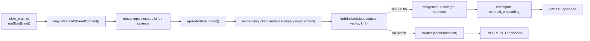
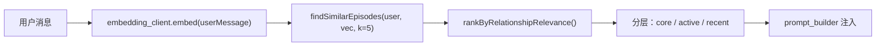
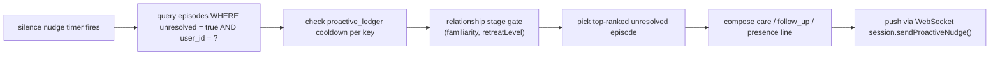

# Rem AI — Memory V2 设计文档

> 对应目标：关系层第二阶段 —— 语义 Episode 聚类 + 关系驱动的主动对话 + 增量更新。
>
> 前置状态：Memory V1 已完成（per-user relationship state 持久化、episode 分层召回、proactive ledger、关系风格槽位）。
>
> **开发阶段约束（重要）**：产品无外部用户，V2 落地不为兼容性和降级留预算。
> - 假设 Postgres + pgvector **必须**可用；没有就直接抛错，不做 keyword fallback。
> - 假设 embedding API（OpenAI 兼容）**必须**可用；没有就直接抛错。
> - 不做数据迁移脚本：旧 JSON state 在 V2 模型下按"冷启动"处理即可。
> - 不做灰度/feature flag：一次切换，不保留旧路径。

---

## 1. V1 做了什么 / 没做什么

### V1 已闭环
- `PersistentRelationshipStateV1` 全量序列化到 `memories` 表（key = `__rem_relationship_state_v1`，value = JSON）
- `SlowBrainStore.recordSharedMoment()` → `buildEpisodes()` 在内存里做**关键词 + 话题**聚类
- `maybeRecordSharedMoment()` 在 slow brain 异步流程里调用
- Memory agent 分层召回（core facts / core episode / active episode / recent shared moment / fallback）

### V1 未解决的核心问题
1. **Episode 聚类是关键词匹配** —— 不会把"昨晚失眠"和"最近一直睡不好"合并到同一个 episode
2. **没有向量索引** —— `memories.embedding vector(1536)` 列存在但**永远为 NULL**
3. **主动开口是规则** —— 仅看 `retreatLevel` / `ignoredProactiveStreak` / `silenceNudgeBaseCooldown`，没有从**关系状态 + 未完结 episode** 做语义决策
4. **全量重算** —— 每次 mutate 都重建整个 episode 集合（P0 memoize 只是缓存读，没省写）

---

## 2. V2 交付边界

### In Scope
| 模块 | 能力 |
|------|------|
| `llm/embedding_client.ts` | OpenAI-兼容 embedding 客户端（新建） |
| `storage/repositories/memory_repository.ts` | `upsertMemory` 扩展写入 embedding；新增 `upsertEpisode` / `findSimilarEpisodes` |
| `storage/schema.sql` | 新增 `episodes` 表（独立于 `memories`） |
| `memory/episode_store.ts` | 新建：episode 的 CRUD + 语义聚类编排层 |
| `brains/slow_brain.ts` | `maybeRecordSharedMoment` 改为异步走 episode store 的语义合并 |
| `brains/slow_brain_store.ts` | 拆出 `buildEpisodes` 的内存路径，改由 episode store 提供快照 |
| `brains/proactive_planner.ts` | 新建：基于关系状态 + 未完结 episode 的主动开口决策 |

### Out of Scope（V2 不做）
- keyword fallback 路径（前置约束）
- 旧数据迁移（前置约束）
- 前端呈现（T-035.x 另开）
- 情绪推断改造（T-040 另开）
- 口型同步（T-032 另开）

---

## 3. 数据模型

### 3.1 新表 `episodes`

```sql
CREATE TABLE episodes (
  id UUID PRIMARY KEY DEFAULT gen_random_uuid(),
  user_id UUID NOT NULL REFERENCES users (id),
  title TEXT NOT NULL,                -- episode 人话标题，如 "最近睡眠一直不好"
  summary TEXT NOT NULL,              -- 由 slow brain 生成的 1-2 句合并叙述
  topics TEXT[] NOT NULL DEFAULT '{}', -- 结构化 topic tag（与 TOPIC_PATTERNS 对齐）
  mood TEXT NOT NULL DEFAULT '',      -- 最近一次触达的主导情绪
  kind TEXT NOT NULL,                 -- 与 SharedMoment.kind 枚举对齐
  salience REAL NOT NULL DEFAULT 0,   -- [0,1] 关系权重
  recurrence_count INT NOT NULL DEFAULT 1,
  unresolved BOOLEAN NOT NULL DEFAULT FALSE,
  first_seen_at TIMESTAMPTZ NOT NULL DEFAULT now(),
  last_seen_at TIMESTAMPTZ NOT NULL DEFAULT now(),
  last_referenced_at TIMESTAMPTZ,     -- Rem 最近一次在对话里引用它的时间
  centroid_embedding vector(768) NOT NULL,  -- 所有 moment 的平均向量（nomic-embed-text）
  origin_moment_summaries TEXT[] NOT NULL DEFAULT '{}',  -- 组成本 episode 的 moment 原文列表（上限 8 条）
  relationship_weight REAL NOT NULL DEFAULT 0, -- V1 就有的字段，继续沿用
  status TEXT NOT NULL DEFAULT 'active'        -- active / archived
);

CREATE INDEX idx_episodes_user_id ON episodes (user_id);
CREATE INDEX idx_episodes_user_status_updated
  ON episodes (user_id, status, last_seen_at DESC);
CREATE INDEX idx_episodes_centroid_ivfflat
  ON episodes USING ivfflat (centroid_embedding vector_cosine_ops)
  WITH (lists = 100);
```

### 3.2 为何 episode 独立成表而不是继续塞 `memories.value` JSON

- **向量索引**：pgvector 的 ivfflat 索引只能挂在列上，JSON 塞进去无法建索引
- **增量更新**：episode 新增/修改不该触发整个关系状态 JSON 的重写（V1 是 rewrite-all）
- **查询语义**：主动策略需要"找最近未完结 + 相似度 > 0.8 的 episode" —— 纯 SQL 直接完成

### 3.3 `memories` 表继续存在

- 保留 `key / value` 结构化事实（名字、城市、兴趣等）—— memory_agent 的正则路径不变
- `memories.embedding` 列**开始真正写入** —— 供跨结构化事实的语义召回
- `__rem_relationship_state_v1` 这个大 JSON 值 **V2 简化**：只留"状态标量"（familiarity / emotionalBond / turnCount / moodTrajectory / continuityCueState / proactiveStrategyState / proactiveLedger）。episodes 字段从 JSON 里**移除**，改从 episodes 表加载。

---

## 4. 运行时数据流

### 4.1 写路径（Slow Brain 异步分析后）



关键点：
- **合并阈值 0.85 cosine**（经验值，进入后再调）
- **Centroid 更新是增量的**：`new_centroid = (old_centroid * n + new_vec) / (n+1)`，不做全量重算
- **同步 vs 异步**：整条链路在 slow brain 的 setTimeout/队列里执行，**不**阻塞 fast brain 回包

### 4.2 读路径（Fast Brain 注入 prompt 前）



关键点：
- **每轮都做一次 embed 调用**（用户消息）—— 需要纳入 fast brain 的延迟预算
  - 预期：OpenAI `text-embedding-3-small` 约 30-80ms，本地 nomic-embed-text ~20ms
  - 若延迟不可接受，**退路**：先发 LLM 再并行 embed+召回，下一轮注入（接受一轮滞后）
- **关系权重排序不是纯 cosine**：`score = 0.6 * cosine + 0.2 * salience + 0.1 * recency + 0.1 * unresolved_boost`

### 4.3 主动开口决策（新增 proactive_planner）



决策输入（全部来自 SlowBrainStore 快照 + episode 表查询）：
- `familiarity` / `emotionalBond` / `retreatLevel`
- `unresolvedEpisodes`（SQL 拉最多 5 条）
- `proactiveLedger[key].nextEligibleAt`
- `moodTrajectory` 最近 5 轮是否偏负面

输出：`{ mode: "care"|"follow_up"|"presence", text: string, episodeId?: string, ledgerKey: string }`

---

## 5. 模块拆分

### 5.1 新建文件

| 文件 | 职责 | 依赖 |
|------|------|------|
| `llm/embedding_client.ts` | 调用 OpenAI 兼容 `/v1/embeddings`；返回 `number[]`；批量接口；简单 LRU 缓存（key = 文本 hash） | `openai` SDK 已在 deps |
| `storage/repositories/episode_repository.ts` | CRUD + 向量相似度查询 | `pg` |
| `memory/episode_store.ts` | 编排：`ingest(moment)` / `findRelevant(userMessage)` / `listUnresolved()` / `recomputeCentroid()` | `episode_repository` + `embedding_client` |
| `brains/proactive_planner.ts` | 主动开口决策 | `episode_store` + `SlowBrainStore` snapshot |
| `test/memory/episode_store.test.ts` | 覆盖 ingest 合并 / 相似度阈值 / centroid 更新 | mocha + chai |
| `test/brains/proactive_planner.test.ts` | 覆盖三种模式选择 | mocha + chai |

### 5.2 修改文件

| 文件 | 改动 |
|------|------|
| `storage/schema.sql` | 追加 `CREATE TABLE episodes ...` + 索引 |
| `storage/repositories/memory_repository.ts` | `upsertMemory` 扩展 embedding 参数；写入时同步计算 embedding |
| `brains/slow_brain.ts` | `maybeRecordSharedMoment` → 改调 `episodeStore.ingest()` |
| `brains/slow_brain_store.ts` | 移除 `buildEpisodes` / `buildTopicThreads`；改为从 `episodeStore` 拉快照；`getSnapshot` 依然 memoize |
| `memory/relationship_state.ts` | `PersistentRelationshipStateV1` → `V2`：删除 `episodes` 字段（改由 episode 表加载） |
| `memory/memory_agent.ts` | `recallEpisodes()` 改走语义检索（而不是关键词 scoring） |
| `server/session/index.ts` | silence nudge 流程改调 `proactive_planner.plan()` |
| `brain/prompt_builder.ts` | episode 注入段改为 `episodeStore.findRelevant(userMessage)` 的结果 |

### 5.3 删除路径

- `slow_brain_store.ts::buildEpisodes()` 私有函数
- `slow_brain_store.ts::buildTopicThreads()` 私有函数
- V1 的 episode JSON 字段（`PersistentEpisode` 类型及相关 hydration 代码）

---

## 6. 环境变量

**新增**：
- `REM_EMBEDDING_BASE_URL` — embedding 服务 baseURL（OpenAI 兼容）
- `REM_EMBEDDING_API_KEY` — key
- `REM_EMBEDDING_MODEL` — 默认 `text-embedding-3-small`（1536 维，与 schema 对齐）

**不新增 feature flag**：V2 直接替换，`REM_EPISODE_MEMORY_ENABLED` 保留但含义变为"是否开启 episode 系统"（默认 `1`）。

---

## 7. 性能预算

| 操作 | 频率 | 目标延迟 | 降级预案 |
|------|------|---------|---------|
| embedding（用户消息） | 每轮 1 次 | < 80ms | 若超，fast brain 先发，下一轮用 |
| episode 相似度查询（读路径） | 每轮 1 次 | < 20ms | ivfflat 索引兜底 |
| episode ingest（写路径） | 每轮 ≤1 次（异步） | 不计入回包延迟 | 失败直接抛，记日志 |
| proactive planner | silence timer 触发 | < 50ms | 失败 fallback 到 V1 规则（这是**唯一**保留的 fallback） |

---

## 8. 落地顺序（按 PR 切分）

> 每一步独立可验证，codex 执行一步、跑一次 typecheck + 相关测试再进入下一步。

1. **PR1 — Schema + Embedding Client**（foundation）
   - 新建 `llm/embedding_client.ts`
   - `storage/schema.sql` 新增 `episodes` 表
   - `storage/repositories/episode_repository.ts` CRUD
   - `storage/repositories/memory_repository.ts` 支持 embedding
   - 单测：embedding client mock + episode repo round-trip
   - **验证**：`npm run typecheck` + `test/storage/episode_repository.test.ts`

2. **PR2 — Episode Store**（编排层）
   - 新建 `memory/episode_store.ts`
   - 实现 `ingest()` 合并逻辑 + centroid 增量更新
   - 实现 `findRelevant()` 读路径
   - 单测：合并阈值 / centroid 正确性 / 排序权重
   - **验证**：`test/memory/episode_store.test.ts`

3. **PR3 — Slow Brain 接线**
   - `brains/slow_brain.ts::maybeRecordSharedMoment` 改接 episode store
   - `brains/slow_brain_store.ts` 删除本地 `buildEpisodes`
   - `memory/relationship_state.ts` 精简为 V2 标量快照
   - `memory/memory_agent.ts::recallEpisodes` 走语义检索
   - **验证**：`npm test`（跑全量 backend 测试）

4. **PR4 — Proactive Planner**
   - 新建 `brains/proactive_planner.ts`
   - `server/session/index.ts` silence nudge 改接 planner
   - 单测：三种模式选择 + ledger 尊重 + retreatLevel 门控
   - **验证**：`test/brains/proactive_planner.test.ts` + 手动 smoke

5. **PR5 — Prompt 注入重构**
   - `brain/prompt_builder.ts` episode 注入段改为 `episodeStore.findRelevant(userMessage)`
   - 单测：注入格式稳定
   - **验证**：`test/brain/**/*.test.ts`

---

## 9. 非设计问题（遗留给后续）

- **遗忘/归档策略**：episode 长时间未触达是否 archive？V2 先不做，留 `status` 字段占位
- **跨用户嵌入共享**：当前只对 `WHERE user_id = ?` 检索，未来多用户要不要做隔离池？V2 不讨论
- **embedding 版本**：模型切换后维度不一致怎么办？V2 假设一次定型，不做版本字段

---

## 10. 开始实施的前置问答

请确认以下几点后，我让 codex 开始 PR1：

1. **embedding 服务用哪个？**
   - `text-embedding-3-small`（OpenAI 官方，1536 维，$0.02/M tokens）
   - 本地 `nomic-embed-text`（Ollama，768 维 —— **schema 需要改成 768**）
   - 项目现有的 `base_url` / `model` 环境变量是否复用一套？还是独立 `REM_EMBEDDING_*`？

2. **episode 表的 `episodes.summary` 由谁写？**
   - 选项 A：ingest 时由 LLM 生成（贵但自然）
   - 选项 B：ingest 时模板拼接 `"{topic}：{latest_moment_summary}"`（便宜够用）
   - V2 建议 **选项 B**，V3 再升级

3. **是否立即删除 `PersistentEpisode` JSON 字段？**
   - 是 → 干净但现有测试 fixtures 要改
   - 否 → 保留但不读（作为 graveyard 字段）
   - 建议 **是**（无历史负担）

回答完这三个问题，我就给 codex 写 PR1 的 brief。
